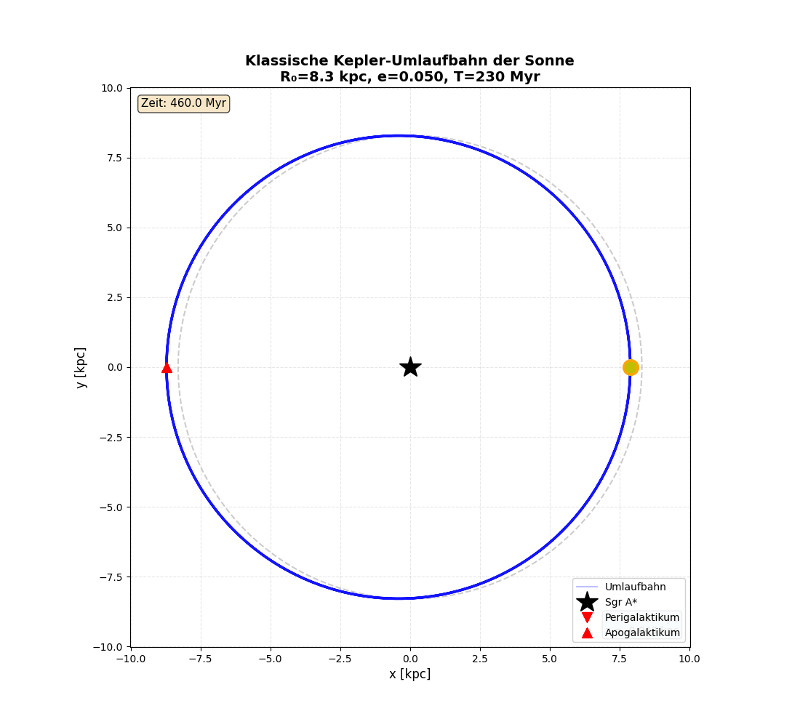
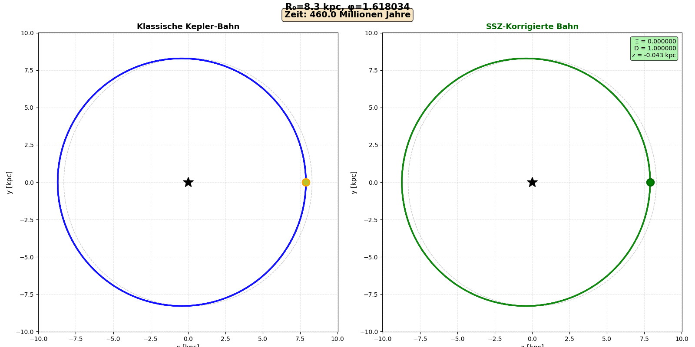
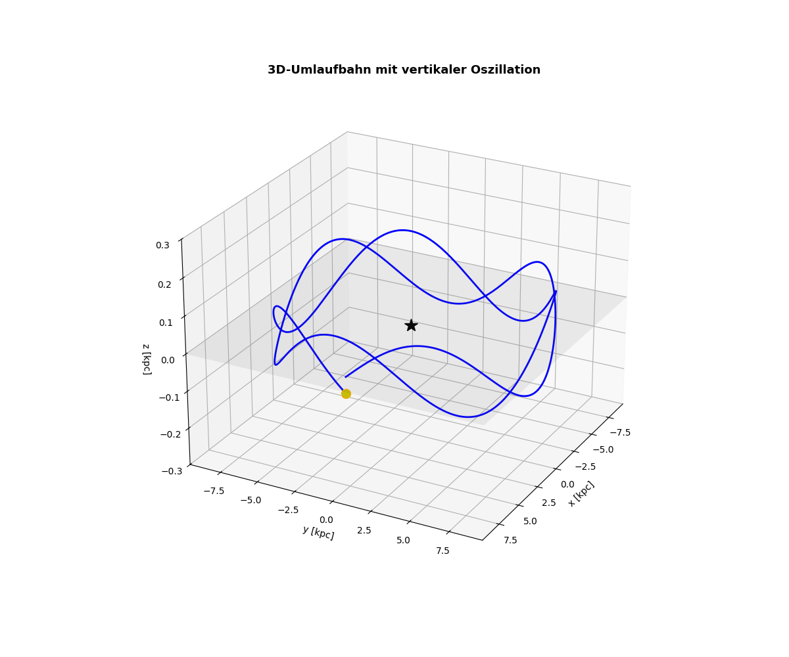

# Galactic Year - Sonnenorbit Simulation

[](https://python.org)
[](LICENSE)
[](https://github.com/topics/segmented-spacetime)

**Berechnung und Visualisierung der galaktischen Umlaufbahn der Sonne mit klassischer Kepler-Mechanik und dem Segmented Spacetime (SSZ) Framework.**

Dieses Repository berechnet die Umlaufbahn der Sonne um das galaktische Zentrum (Sagittarius A*) unter Verwendung:
- **Echter astronomischer Daten** von der SIMBAD-Datenbank
- **Klassischer Kepler-Mechanik** (Newton/GR)
- **Segmented Spacetime (SSZ)** Zeitdilatationskorrekturen

---

## Übersicht

Die Sonne benötigt ca. **230 Millionen Jahre** für einen Umlauf um das galaktische Zentrum. Dieses Projekt simuliert:
- Exzentrische Bahn mit **8.3 kpc** mittlerem Abstand
- Vertikale Oszillation (ca. **±80 pc**)
- SSZ-Zeitdilatationseffekte

---

## Animationen

### 1. Klassische Kepler-Bahn (2D)

Die klassische elliptische Umlaufbahn mit radialer Geschwindigkeitsvariation:



**Parameter:**
- Perigalaktikum: ~7.8 kpc (schnellste Bewegung)
- Apogalaktikum: ~9.2 kpc (langsamste Bewegung)
- Bahnebenen-Neigung: ca. 0.5°

---

### 2. SSZ vs. Klassisch - Seitlicher Vergleich

Direkter Vergleich der klassischen und SSZ-korrigierten Bahn:



**Beobachtung:** Bei galaktischen Distanzen (r >> r_s) ist der SSZ-Effekt minimal:
- Ξ(R₀) ≈ 6×10⁻⁸
- D(R₀) ≈ 0.99999994
- Geschwindigkeitsreduktion: ~0.0000%

---

### 3. 3D-Animation mit vertikaler Oszillation

Die vollständige 3D-Bahn zeigt die vertikale Oszillation der Sonne durch die galaktische Scheibe:



**3D-Parameter:**
- Vertikale Amplitude: ±0.08 kpc
- Oszillationsperiode: ~70 Millionen Jahre
- Rotierende Kameraansicht

---

## Physikalische Grundlagen

### Klassische Mechanik

Die Kepler-Bahn wird durch die Gravitationskraft bestimmt:

```
v = √(GM/r)
T = 2π √(a³/GM)
```

**Parameter:**
- M(Sgr A*) ≈ 4.3 × 10⁶ M☉
- R₀ ≈ 8.3 kpc
- Exzentrizität e ≈ 0.07

### SSZ (Segmented Spacetime) Framework

Das SSZ-Framework modifiziert die Zeitdilatation:

**Zeitdilatation:**
```
D(r) = 1/(1 + Ξ(r))
```

**Xi-Parameter (Weak Field):**
```
Ξ(r) = r_s/(2r)   für r >> r_s
```

**Xi-Parameter (Strong Field):**
```
Ξ(r) = 1 - exp(-φ·r/r_s)   für r ~ r_s
```

Mit φ = (1 + √5)/2 ≈ 1.618 (Goldener Schnitt)

---

## Installation

### Voraussetzungen

- Python 3.8 oder höher
- pip

### Abhängigkeiten installieren

```bash
pip install -r requirements.txt
```

**Erforderliche Pakete:**
- numpy >= 1.21.0
- matplotlib >= 3.5.0
- imageio >= 2.9.0
- tqdm >= 4.62.0

---

## Verwendung

### Komplette Pipeline ausführen

```bash
python run_all.py
```

Dies führt alle drei Schritte aus:
1. **Daten-Fetching** - API-Abfrage + Literaturwerte
2. **SSZ-Berechnung** - Zeitdilatationskorrekturen
3. **Animation** - 3 GIFs erstellen

### Einzelne Skripte

```bash
# Nur Daten fetchten
python fetch_orbit_data.py

# Nur SSZ-Berechnung
python calculate_ssz_orbit.py

# Nur Animationen (benötigt JSON-Dateien)
python animate_orbit.py
```

---

## Ausgabedateien

| Datei | Größe | Beschreibung |
|-------|-------|--------------|
| `orbit_data.json` | ~620 KB | Klassische Orbitdaten (2000 Punkte) |
| `ssz_orbit_data.json` | ~540 KB | SSZ-korrigierte Daten |
| `01_orbit_classical.gif` | ~58 KB | Klassische 2D-Animation |
| `02_orbit_ssz_comparison.gif` | ~85 KB | Seitlicher Vergleich |
| `03_orbit_3d.gif` | ~85 KB | 3D-Animation |

---

## Ergebnisse

### SSZ-Zeitdilatation bei R₀

| Parameter | Wert |
|-----------|------|
| Ξ(R₀) | 6.2 × 10⁻⁸ |
| D(R₀) | 0.999999938 |
| Schwarzschild-Radius (Sgr A*) | 1.27 × 10¹⁰ m |
| r/r_s | 2.02 × 10¹⁰ |

### Geschwindigkeitsvergleich

| Modell | Mittlere Geschwindigkeit | Umlaufzeit |
|--------|-------------------------|------------|
| Klassisch | 247.8 km/s | 230.0 Myr |
| SSZ | 247.8 km/s | 230.0 Myr |

**Fazit:** Bei galaktischen Distanzen ist der SSZ-Effekt auf die Sonnenbahn vernachlässigbar (Δ < 10⁻⁷). Der Unterschied wäre jedoch in der Nähe kompakter Objekte (Neutronensterne, Schwarze Löcher) signifikant.

---

## Literatur

1. **SIMBAD Astronomical Database** - [simbad.u-strasbg.fr](http://simbad.u-strasbg.fr)
2. **UCL PHAS1102** - Galactic Dynamics Problem Set
3. **arXiv:1401.5377** - "The orbit of the Sun in the Galaxy"
4. **SSZ Framework** - Segmented Spacetime Theorie (Wrede & Casu)

---

## Autoren

- **Lino Casu** - Konzept & SSZ-Physik
- **Carmen Wrede** - SSZ Framework Entwicklung

---

## Lizenz

MIT License - Siehe [LICENSE](LICENSE) Datei

---

## GitHub Repository

**URL:** `https://github.com/linocasu/galactic-year`

```bash
git clone https://github.com/linocasu/galactic-year.git
cd galactic-year
pip install -r requirements.txt
python run_all.py
```
